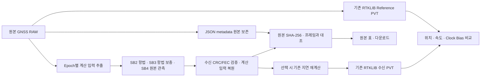

# LNIS 송수신 시험

**이 시험은 데이터를 보내고 받는 데 걸린 시간을 GNSS 의사거리로 계산했을때, PVT 계산기가 그 공통 지연을 수신기 시계 오차(Clock Bias)로 해석하는지 확인하는 시험입니다.**

원본 GNSS의 한 관측 시점(1 Epoch)으로 기준 PVT를 구한 뒤, 시험 시작부터 수신 완료까지 걸린 시간을 측정합니다.
그 시간을 모든 위성의 의사거리에 동일하게 추가하고 PVT를 다시 계산하여, 원본 대비 위치·속도·Clock Bias가 얼마나 달라졌는지 비교합니다.
GNSS 수집 후 시험 시작 전까지 기다린 시간은 추가하지 않습니다.

```text
원본 GNSS → 기준 PVT 확보 → 시험 시작·전송 → 수신 완료·지연 측정
         → 위성별 의사거리에 같은 지연 추가 → PVT 재계산 → 기준값과 비교
```

**예상 결과는 위치와 속도는 거의 유지되고, Clock Bias는 추가한 지연시간만큼 증가하는 것입니다.**
이 결과를 미리 넣어 맞추는 것이 아니라, 계산기가 실제로 구한 Clock Bias 증가량과 측정 지연의 차이를 확인합니다.
위치·속도의 작은 변화도 그대로 표시합니다. 실제 위성이 지연시간 동안 이동한 상황이나 실제 위치 정확도를 검증하는 시험은 아닙니다.

Java 21 · Spring Boot · H2 · HTML/JavaScript. 기존 AFS 코덱과 GPS L1 지구 PVT 계산기를 재사용합니다.

## 실행 구조

- **송신 PC:** LNIS Sender + 송신 DTN/HDTN 어댑터 + 로컬 공유 파일 폴더.
- **수신 PC:** LNIS Receiver + 수신 DTN/HDTN 어댑터 + 별도 로컬 공유 파일 폴더.
- 각 PC에서 LNIS는 한 JVM으로 실행합니다. DB와 파일은 서로 공유하지 않습니다.
- 개발 PC에서는 Docker Desktop의 8090/8091로 두 역할을 구분합니다. 운영은 WSL2 배포판 내부 Linux Docker Engine입니다.
- 어댑터는 별도 개발 프로그램입니다. LNIS가 DTN/HDTN 자체를 구현하지 않습니다.

## 실행·설정

애플리케이션 설정은 `src/main/resources/application.yml` 하나에서 관리합니다. 내부의 `spring.config.activate.on-profile` 조건으로 공통·서버·통합 노드·별도 Agent 설정을 구분하며, PC별 주소·포트·토큰은 기존처럼 `.env`로 지정합니다.

독립 노드 배포 폴더에서 `.env`의 역할·포트·본인/상대 URL·관리 토큰을 설정하고 실행합니다.

```sh
docker compose up -d --build
docker compose ps
```

주요 설정: `LNIS_NODE_ROLE`, `LNIS_SERVER_PORT`, `LNIS_NODE_BASE_URL`, `LNIS_NODE_PEER_URL`, `LNIS_NODE_MANAGEMENT_TOKEN`,
`dtn_adapter`, `LNIS_DTN_SEND_TOKEN`, `LNIS_DTN_RECEIVE_TOKEN`.
관리 토큰은 양쪽 동일하게, 어댑터 토큰은 해당 연결 상대와 맞춥니다. 기존 DB·토큰을 임의 삭제하지 마세요.

- AFS 화면: `/lnis/afstest/sender`, `/lnis/afstest/receiver`
- DTN 화면: `/lnis/dtntest/sender`, `/lnis/dtntest/receiver`
- [운영 USB/WSL2 연결](deployment/node/WSL2-GNSS.md)
- [어댑터 개발자 공유 계약 — API-SPEC 맨 아래 15장 전체](API-SPEC.md#adapter-contract)

## 시험

DTN의 GNSS 수집 데이터 화면은 관측값(RAWX)과 항법정보(SFRBX)를 별도 표로 표시합니다. 항법 메시지는 중복을 포함해 보존하며, 펼침 메뉴에서 저장된 전체 필드를 확인할 수 있습니다. 현재 GRAW는 RAWX/SFRBX와 수집 메타데이터를 저장하며 NAV-PVT·NMEA 등 수신기의 다른 출력은 포함하지 않습니다.

1. 송신 화면 우측 상단 **설정**에서 시험 종류·DTN/HDTN 경로·연결 주소·COM/GRAW 입력을 선택합니다. GRAW 파일 적용과 저장된 I/Q 선택도 설정에서 합니다.
2. **시험 화면으로** 돌아와 COM 수집·I/Q 생성·전송을 실행하고 관측값·송신 지구 PVT를 확인합니다. 화면 전환은 입력과 진행 상태를 유지하며, 처리 중 설정은 읽기 전용입니다. 선택값은 매 REST JSON에 포함됩니다.
3. 수신 결과와 JSON 원문을 확인합니다.

- **HDTN 설정:** 동시 번들 수·합계 용량, 우선순위, 저장 공간 부족 시 대기 시간, 최대 번들 크기, TCPCL 세그먼트 크기, 삭제 정책을 설정하며, 고급 설정에서 저장 용량·LTP·ACS를 조정합니다. 전체 기본값 복원 버튼을 제공합니다. HDTN이 포함된 경로에서만 `hdtnConfig`로 전달하며 시험 시작 시 DB에 확정 저장합니다. 실제 적용은 어댑터가 담당합니다. DTN 전용 설정은 규격 확정 전까지 전송하지 않습니다.
- **시험 중지:** 송신에서 누르면 LNIS 처리와 상대 수신 시험의 중지를 요청합니다. 상대 연결이 끊겼으면 `cancelPending`으로 보관하고 연결 복구 후 재시도합니다. 기존 이력·원문·완료 결과는 보존하며, 이미 외부 어댑터에 전달된 번들의 전송 중단까지 보장하지는 않습니다. I/Q 생성 자체는 별도의 **생성 취소**를 사용합니다.
- 수신 화면은 새 JSON이 접수되면 해당 시험을 자동 선택합니다.

| 시험 | 전송 내용 | 검증 |
|---|---|---|
| GNSS RAW | 원본 GRAW 바이트의 Base64 | 입력 무결성·송수신 지구 PVT |
| AFS + Metadata | 원본 형식 AFS SB2 항법정보 + JSON 관측값·보조 항법정보 | 복원 무결성·송수신 지구 PVT |
| I/Q Sample | 90초 BIN 경로·크기·해시 + GPS LNAV + 초기 기준 PVT | 파일 무결성·I/Q 추적 관측값·보조 항법 기반 지구 PVT 오차 |

PVT는 지구 ECEF GPS L1 SPP입니다. 송수신 일치는 계산 재현성 검증이며 실제 위치 정확도 보증이 아닙니다.
수신 화면은 전송 JSON의 송신 기준 PVT와 독립 계산한 수신 PVT를 좌우로 비교하고, 일치 여부와 차이를 표시합니다. 기준값이 없는 과거 시험은 비교 불가로 표시합니다. 송신 화면에는 기준 PVT만 표시하며 서버의 비교 판정은 유지합니다.

송수신 로그의 **상세 로그**에서 처리 단계·수량·검증 결과를 확인하고 시험 기록을 선택해 TXT로 다운로드할 수 있습니다. LNIS 자체 처리 로그는 각 PC에 저장합니다. 어댑터가 수신 JSON에 `dtnLogsBase64`로 첨부한 로그는 수신에서 해석하여 수신 상세 로그에만 남깁니다. 송신에는 상대 수신·완료·실패 상태만 표시합니다. 잘못된 로그 형식은 경고로 남기며 시험 데이터 접수를 막지 않습니다. ‘화면 지우기’는 저장 기록을 삭제하지 않으며, 시험에 연결하지 않은 준비 로그는 7일 후 정리합니다.
관측값만 있는 파일은 GNSS RAW 시험으로 전달 가능하지만 PVT는 판정 불가입니다.

### 지연 반영 PVT와 Clock Bias 확인

송신 **시험 설정** 제목 오른쪽의 **지연 반영 PVT** 체크박스로 선택합니다. GNSS RAW / AFS + Metadata에 적용하며,
입력의 첫 유효 Epoch와 선행 항법정보를 사용합니다. 해제하면 기존 원본 복원 비교를 수행합니다.

```text
S  = 송신 서버 시험 시작 요청 접수 시각
R  = 수신 서비스 본문 수신 완료 시각
Δt = R − S

원본 위성 송신 시각 추정 = 원본 GNSS 관측 시각 − 원본 의사거리/c
시험 기준 보정 송신 시각 = S − 원본 의사거리/c
변환 후 의사거리        = 원본 의사거리 + c×Δt

Clock Bias 변화량 = 수신 재계산 Bias − Reference Bias
지연과의 차이     = Clock Bias 변화량 − Δt
```

`c=299,792,458 m/s`입니다. **수집 후 시험 시작 전 대기시간은 제외**하며, 시험 접수 이후 준비·어댑터 처리·전송 시간은
포함합니다. 보정 송신 시각은 시험 시작에 맞춘 가상 시각입니다. PVT 계산은 원본 GNSS 시간축에 지연을 더하고
원본 Ephemeris를 유지하므로, 실제 시험 날짜의 위성 이동을 재현하는 시험은 아닙니다.

| 확인 위치 | 표시 내용 |
|---|---|
| 송신 화면·로그 | 원본 Reference PVT, 어댑터 접수까지의 송신 작업, 이후 상대 수신·완료·실패·취소 상태 |
| 수신 RAWX 표 | 위성별 원본/변환 후 의사거리와 증가량, 원본/변환 후 GNSS 관측 시각 |
| 수신 PVT 비교 | Reference와 재계산 PVT, 위치·속도 차이, 측정 지연·Clock Bias 변화·지연과의 차이 |
| 수신 상세 로그·다운로드 | 위성별 원본 송신 시각 역산·시험 기준 보정 시각·의사거리 변환식, Clock Bias 검증식 |

송신 작업 로그는 어댑터 접수까지이며, 이후에는 `[상대 결과 확인]`으로 수신·완료·실패·시간 초과·취소 상태만 확인합니다.
어댑터 내부 로그와 PVT 비교 수치는 수신측 화면·상세 로그에서 확인합니다. 기존에 송신에 복사된 어댑터 상세와 최종 수치 로그는
DB에서 삭제하지 않고 송신 로그 조회·다운로드에서 제외합니다. 송신의 비교 결과 저장과 원격 상태 확인은 유지합니다.

Doppler·C/N0·반송파·항법정보는 원본을 유지합니다. 원문 보기와 JSON 다운로드도 실제 수신 원본을 반환합니다.
변환 후 표는 저장된 계산 근거와 Epoch·위성·신호·원본 값이 일치할 때만 표시하며, 근거가 없거나 계산할 수 없으면 `—`로 표시합니다.

모든 위성에 같은 지연을 더하면 그 공통 성분은 주로 Clock Bias 증가로 나타납니다.
따라서 위치 차이가 작아도 지연이 없었다는 뜻은 아닙니다. 원본 Doppler를 유지하므로 속도는 거의 같을 것으로 예상하지만,
재계산 위치·위성 방향·보정값·수치 정밀도 영향으로 작은 차이는 생길 수 있으며 결과를 강제로 0으로 맞추지 않습니다.

`MEASURED`는 측정 완료, `PARTIAL`은 속도 비교 불가, `INCONCLUSIVE`는 유효한 비교 불가를 뜻합니다.
합격 허용오차는 설정하지 않습니다. 위치 차이는 Reference 대비 차이이며 실제 위치 정확도를 보증하지 않습니다.
시간 차이의 거리 환산값도 위치 오차와 다릅니다. 서로 다른 PC의 시각을 사용하므로 시계 동기화 정확도는 별도로 확인해야 하며,
ns 표시 자릿수는 실제 측정 정확도를 의미하지 않습니다. 증거가 있는 과거 지연 시험도 새 수치를 조회할 수 있지만 과거 로그는 재작성하지 않습니다.


## AFS 프레임 안에서 PVT 입력 전달

신규 전송은 `schemaVersion=4`, `format=LNIS-AFS-GNSS-v4`입니다. 각 Epoch의 **GPS L1 관측 위성마다 한 프레임**을 만듭니다. 여러 Epoch는 각각 독립된 위성별 프레임 묶음으로 전송합니다. 지연 시험은 기존처럼 선택한 1 Epoch만 사용합니다.



프레임에서 복원한 계산 입력과 원본 metadata가 다르면 거절합니다. 수신 계산은 metadata나 Reference PVT로 누락된 프레임을 대신하지 않습니다. `sourceSha256`은 여전히 원본 GRAW 전체의 해시입니다. `satellites[].metadata.navigationSupplement`는 v4에서 **원본 항법 word 전체**를 보존하며, v2/v3의 SB2 제거 잔여 word와 의미가 다릅니다. JSON 필드 구조는 유지하고 버전으로 구분합니다.

### 6,000비트 구조와 부호화

| 구간 | 부호화 전 | 오류 검출·정정 | 전송 비트 |
|---|---:|---|---:|
| 동기 패턴 | 68 | 고정 패턴 | 68 |
| SB1 | FID·TOI 입력 | 기존 BCH | 52 |
| SB2 | 데이터 1,176 + CRC 24 = 1,200 | 기존 LDPC·천공 | 2,400 |
| SB3 | 데이터 846 + CRC 24 = 870 | 기존 LDPC·천공 | 1,740 |
| SB4 | 데이터 846 + CRC 24 = 870 | 기존 LDPC·천공 | 1,740 |
| 합계 | | | **6,000 = 750 bytes** |

```text
부호화 전: SB2 [1176 + CRC24]  SB3 [846 + CRC24]  SB4 [846 + CRC24]
                  ↓ LDPC             ↓ LDPC            ↓ LDPC
부호화 후:       2400                1740               1740
                  └──────────────────┬──────────────────┘
                           5880비트 인터리빙 (98×60)
최종:      [동기 68][SB1 BCH 52][인터리빙된 SB2·SB3·SB4 5880] = 6000
```

최종 비트열에서 SB2·SB3·SB4가 그대로 연속 배치되는 것은 아닙니다. 각 크기·CRC·BCH·LDPC·인터리빙은 기존 SIM/PocketSDR를 사용합니다. 공식 근거는 [NASA LSIS AFS Volume A v1.0](https://www.nasa.gov/wp-content/uploads/2025/02/lunanet-signal-in-space-recommended-standard-augmented-forward-signal-vol-a.pdf)입니다. SB3·SB4는 **LNIS 시험용 확장**이며, type=63은 공식 할당을 주장하지 않는 로컬 식별값입니다. 지구 GPS 정보를 사용하는 이 시험은 LunaNet 운용 메시지 전체의 적합성 인증이 아닙니다.

### LNIS SB3·SB4 배치 (CRC 제외)

모든 다중 비트 값은 상위 비트부터 저장합니다. 관측 시각·의사거리는 IEEE 754 binary64, Doppler는 binary32로 원본 정밀도를 유지합니다.

```text
공통 헤더 57비트:
  messageType 6 | version 8 (=2) | block 3 (=3/4) | epochIndex 32 | PRN 8

SB3 846비트:
  공통 헤더 57 | 항법 존재 1 | SB2에 없는 LNAV 비트 459 | 예약 329
  사용 517비트. LNAV 1·2·3의 720비트 중 SB2에 실린 261비트를 제외.
  수신 시 SB2와 결합해 기존 RTKLIB 항법 해석기에 전달.

SB4 846비트:
  공통 헤더 57 | 원본 관측 순서 8 | GPS week 16 | 원본 TOW 64
  원본 의사거리 64 | Doppler 32 | C/N0 8 | 추적 상태 8
  전리층 정보 존재 1 | 해당 항법 PRN 8 | GPS 전리층 항법 페이지 240 | 예약 240
  사용 606비트. 전리층 정보가 없으면 존재=0, PRN·페이지=0.
```

SB4 의사거리는 **송신 원본**입니다. 수신부에서 `Δt=본문 수신 완료−시험 시작 접수`를 구하고, `P′=P+cΔt`, 계산용 GNSS 시각 `t₁=t₀+Δt`를 적용합니다. 시험 기준 가상 송신 시각 `S−P/c`도 기존 상세 로그에 표시합니다. 수집 후 시험 전 대기시간은 포함하지 않습니다.

원본 UUID·수집 이력·비GPS 신호·반송파 등은 JSON metadata에 그대로 남습니다. GPS 계산 대상이 없는 Epoch는 PRN=0, 관측 순서=255의 빈 Epoch 표식으로 보존하며 가상 위성을 만들지 않습니다. 항법정보가 없는 위성은 항법 존재=0으로 표시해 기존 계산기의 유효성 판단을 유지합니다.

수신 화면의 **AFS 프레임에서 복원한 PVT 계산 입력**을 펼치면 원본 보존 RAWX와 구분해 복원한 의사거리·Doppler·시각을 확인할 수 있습니다. 과거 v1/v2/v3 수신·결과 조회, 별도 AFS 오류 주입 시험, GNSS RAW 시험은 유지합니다. 어댑터는 새 버전의 전체 JSON을 그대로 중계해야 합니다.

합성 예제는 SFRBX 96건(32 PRN×3개 항법 메시지)을 보존하지만, v4 계산 프레임은 실제 관측 GPS 5개에 대해 **5개** 생성합니다. 과거 v3는 항법 세트 기준으로 32개를 생성했습니다.

I/Q는 송신에서 `LNIS_IQ_ENABLED=true`로 활성화합니다. 양쪽 LNIS와 **각자의 로컬 어댑터**가 공유 폴더를 `/exchange`에 마운트해야 합니다.
COM/GRAW 입력 적용 → 지구 PVT 계산 → 90초 I/Q 생성 → 전송 → 수신 추적·지구 PVT 계산 순서입니다. 위 공통 구성기로 만든 SB2·SB3·SB4를 PRN별로 반복·합산하며 SB1의 프레임 시각을 갱신합니다. 90초 동안 다른 Epoch 데이터를 새로 수집하지 않습니다. AFS 변조·부호화는 원본을 사용하며, 원본의 공유 위상/난수 상태 충돌 방지를 위해 생성은 단일 스레드로 실행합니다. 초기 PVT의 등속 운동을 가정한 시험 신호이며 실측 RF가 아닙니다.
기존 LANS AFS 시뮬레이터의 90초·12 MHz 출력은 2.16 GB입니다. REST로 파일 본문을 보내지 않습니다.
빌드 사본에서 원본의 0.1초 부족한 출력 루프를 보정하며, 실제 바이트 수로 90초를 검증합니다. 원본 파일은 수정하지 않습니다.
수신 어댑터는 수신 PC 폴더에 BIN을 완성한 다음 원래 JSON으로 콜백합니다. LNIS가 PocketSDR의 AFS 탐색·추적·CRC 검증 후 의사거리·도플러·상대 누적 위상을 얻고, 신규 파일은 실제 복호한 SB2·SB3·SB4의 항법정보로 기존 RTKLIB 지구 PVT를 계산합니다. SB4 원본 의사거리로 신호 추적값을 대체하지 않습니다. 과거 v1 파일은 JSON 항법정보 보조 방식을 유지합니다. 송신 RAWX나 기준 좌표를 수신 계산에 넣지 않습니다.
수신 화면에는 **I/Q 복원 관측값(수신기 RAWX 원본 아님)**, 프레임 복원 항법정보(과거 파일은 보조 LNAV), 동일 샘플 시각의 기준/수신 PVT와 오차가 표시됩니다. 파일 `PASS`와 PVT `MEASURED`(오차 측정)는 별개이며, I/Q 정확도 합격 허용오차는 아직 설정하지 않았습니다. 추적 초기에는 PVT가 없을 수 있습니다. 메타데이터가 없는 과거 파일은 파일 검증만 가능하므로 PVT 시험에는 새로 생성하세요.

새 I/Q는 `LNIS-IQ-FILE-v2`, `pvtMethod=AFS_IQ_FRAME_PVT-v2`로 구분합니다. JSON의 PRN·첫 샘플 시각·Reference는 탐색/비교용이며 항법정보는 CRC 검증된 프레임에서 확보합니다. 4개 미만 PRN의 계산 프레임만 복원되면 메타데이터로 우회하지 않고 오류를 표시합니다. I/Q에는 기존처럼 통신 지연 재계산을 적용하지 않습니다.

## 개발용 눈으로 확인

운영 ZIP에서는 개발용 중계·예제를 제외합니다. 개발 시만 `deployment/node/docker-compose.dev.yml`, `dev-relay.mjs`와 생성한 `examples`를 배포 폴더에 둡니다.
두 노드가 사용할 `lnis-development` Docker 네트워크를 먼저 생성합니다.
개발 중계기는 REST 전달과 두 로컬 폴더 사이 파일 복사만 수행하며 **실제 DTN/HDTN 시험이 아닙니다.**

- Windows 개발: `COMPOSE_FILE=docker-compose.yml;docker-compose.dev.yml`
- Linux 개발: `COMPOSE_FILE=docker-compose.yml:docker-compose.dev.yml`
- 송신에만 `COMPOSE_PROFILES=relay`, `LNIS_DEV_EXAMPLES=true`.
- `LNIS_DEV_RECEIVE_TOKEN`은 수신 LNIS의 수신 토큰, `LNIS_DTN_SEND_TOKEN`은 개발 중계 접수 토큰으로 설정합니다.
- 중계 기본 콜백은 개발용 수신 8091입니다. 운영 주소·포트 계약이 아닙니다.

송신 설정의 **합성 PVT 수집 재생 · 개발용**은 기본 `hidden`입니다. 개발자 도구에서 숨김을 해제하고 누르면 유효한 PVT 입력을 재생합니다.
같은 입력으로 RAW와 AFS를 전송해 수신 화면과 비교하세요.
이는 F9T 실측/COM 수집이 아닙니다. 기존 F9T 공개 예제는 항법정보가 없어 PVT 계산용이 아닙니다.

## 빌드·검증

```powershell
.\gradlew.bat nativeBuild
.\gradlew.bat check bootJar -PnativeCandidate=build/native-pvt
.\gradlew.bat syntheticGraw
```

- JAR: `build/libs/lnis.jar`
- 합성 입력·예상 PVT: `build/dtn-example/synthetic-earth-pvt.graw`, 동일 이름 JSON
- Linux 코덱: `build/native-linux/libLnisAfsCodec.so`
- Windows 후보 DLL: `build/native-pvt/LnisAfsCodec.dll` — 기존 DLL을 자동 덮어쓰지 않습니다.
- 90초 I/Q 생성기·수신 추적기: `build/iq/afs_sim`, `build/iq/pocket_trk`
- 배포 ZIP: `gradlew.bat linuxNodeDistZip -PnativeCandidate=build/native-pvt`

빌드는 **전체 JDK 21**, Docker Linux 컨테이너 환경, Node.js가 필요합니다. Windows는 `gradlew.bat`, WSL2/Linux는 `./gradlew`를 사용합니다. Linux에서 검증할 때는 `-PnativeCandidate=build/native-linux`를 지정합니다.
특정 WSL 배포판이나 외부 `오픈소스` 폴더, 사전 컴파일된 `libldpc.a`/`libsdr.a`는 더 이상 필요하지 않습니다.

### 원본·수정본 위치

- `native/vendor/`: 필요한 원본 **파일 전체**를 주석·줄바꿈까지 그대로 보관합니다. 외부 프로젝트 전체를 복사한 것은 아닙니다.
- `native/patches/`: 불가피한 수정만 보관합니다. 수정 위치의 `LNIS 변경` 주석에 목적과 내용을 적었습니다.
- `native/lnis_*.c`, `native/iq_earth.c`: 서비스 입력·지구 PVT·AFS 연결 코드입니다.

빌드는 원본 SHA-256 검증 후 컨테이너 내부 복사본에만 패치를 적용합니다. 원본 또는 패치가 맞지 않으면 실패하며 원본은 덮어쓰지 않습니다.
주석이 포함된 실제 수정본은 빌드 후 `build/native-output/modified-sources/`에서 확인할 수 있습니다.
자세한 출처·기능별 대응·수정 이유는 [네이티브 유지보수 안내](native/README.md)를 참고하세요.

### 새 PC 배포

`build/distributions/lnis-node-linux.zip`을 송신·수신 PC에 각각 풀고 `.env.example`을 `.env`로 복사해 역할과 주소를 설정합니다. 이후 `docker compose up -d --build`로 실행합니다.
배포 폴더에 JAR·SO·I/Q 실행파일과 필수 데이터가 포함되어 있으므로 **실행 PC에는 JDK·컴파일러·외부 원본 소스가 필요하지 않습니다.** 최초 기본 이미지 다운로드에는 인터넷이 필요합니다.
`licenses/native-sources.zip`에는 원본·패치·빌드 자료를 함께 제공합니다.

독립 실행 회귀시험은 배포 ZIP을 `build/native-system/bundle`에 푼 뒤 아래 명령으로 실행합니다.
18090/18091 포트를 사용하며 기존 8090/8091 서비스·DB를 건드리지 않습니다. 90초 I/Q 생성과 복사에 디스크 여유 공간이 필요합니다.

```sh
docker build -t lnis-native-verification:local build/native-system/bundle
docker compose -f src/test/dtn-native-compose.yml up -d
# 양쪽 서비스 시작 완료 후 실행 (앞서 syntheticGraw 실행 필요)
node src/test/js/dtn-live-roundtrip.mjs
docker compose -f src/test/dtn-native-compose.yml down
```

결과는 `build/native-system/results.json`에 기록합니다. 개발용 REST 중계 검증이며 실제 DTN/HDTN 동작 검증은 아닙니다.

일반 `build`는 운영 폴더를 변경하지 않습니다. 배포는 명시적으로 수행합니다.
실제 F9T·운영 WSL2 USB·실제 DTN/HDTN 연동은 합성 데이터 회귀시험과 별도로 확인해야 합니다.
기존 중앙 서버/Windows Agent 모드는 유지하며 설정은 [기존 배포 문서](deployment/compose/README.md)를 참고하세요.


## 유지보수할 때 찾을 위치

| 영역 | 위치 | 역할 |
|---|---|---|
| 실행 모드 | `server/bootstrap` | 중앙 서버·독립 노드·별도 Agent 시작 |
| 서버 기능 | `server/central` | 기존 Controller → Service → Repository 구조 |
| 로컬 실행기 | `server/agent` | 수집·송수신·코덱 실행 |
| 공통 계약 | `server/shared` | 모델·명령·코덱 계약 |
| 화면 공통 | `static/assets/common` | 기본 CSS, HTTP 요청, 노드 연결 |
| AFS 화면 | `static/assets/afs` | 송수신 화면, 결과 표시, 프레임·로그 |
| DTN 화면 | `static/assets/dtn` | 송수신 화면, 어댑터 상태, 관측값·원문·로그 |

화면 HTML 4개는 `static` 바로 아래에 둡니다. 기존 `/lnis/assets/*.js`·CSS 주소는 새 위치로 리다이렉트하므로 캐시된 HTML에서도 파일을 찾을 수 있습니다.
`common/api.js`는 기존 import 진입점이며, JSON 응답 처리는 `common/http.js`, AFS 결과 표시는 `afs/result-presentation.js`에서 관리합니다. 빈 응답·404·오류 문구 정책은 호출 화면별로 유지하며 바이너리 다운로드와 WebSocket은 별도 처리합니다.
DTN 스타일은 기존 적용 순서를 유지한 `dtn/dtn-ui.css` 하나에 모았습니다. 개발용 합성 재생 영역의 `hidden`과 `/clear`의 화면 초기화 동작은 유지합니다.

## 기존 WSL 노드에 JAR 갱신

저장소에서 다음 명령을 실행합니다. 새 설치·네이티브 라이브러리 교체는 기존 배포 ZIP 절차를 사용합니다.

```powershell
.\gradlew.bat check bootJar
.\scripts\deploy-nodes.ps1 -ValidateOnly
.\scripts\deploy-nodes.ps1
```

기본 대상은 `C:\lnis-compose`와 `C:\lnis-compose-리시버`입니다. 하나만 갱신하려면 `-TargetDirectories 'C:\lnis-compose'`를 지정하고, WSL 배포판은 `-Distribution Ubuntu`로 선택합니다. 진행 중인 시험·수집을 종료한 뒤 실행하세요.

스크립트는 기존 `node` 서비스의 이미지·DB 마운트를 확인하고 JAR의 SHA-256과 필수 ZIP 항목을 검증한 다음 교체합니다. 각 노드의 `backups/날짜-시간`에 이전 JAR·설정과 정지 상태의 DB를 보관하고, 이미지를 빌드한 뒤 노드를 순서대로 재기동하여 Docker readiness를 기다립니다. Compose에 `build`가 없는 수신 노드도 지원합니다. 기존 `.env`, Compose, Dockerfile, 네이티브 파일은 덮어쓰지 않습니다.
실패한 노드는 이전 JAR·이미지로 복구를 시도합니다. 앞서 성공한 노드는 새 버전을 유지하며 DB는 자동으로 과거 상태로 되돌리지 않습니다. 기존 중앙 서버/Windows Agent용 배포와 개발 중계·USB용 Compose 추가 파일은 각 실행 방식에 필요하므로 유지합니다.


### HDTN 설정 화면

전송 경로 아래 HDTN 영역에서 기본 7개 항목을 설정하고, 접힌 ‘고급 설정’에서 저장 용량·LTP 패킷 크기·ACS 주기를 수정합니다. ‘전체 기본값’은 10개 값을 한 번에 초기화합니다. 우선순위 기본값은 false, TCPCL은 20,000 Bytes이며 허용 범위는 20,000~200,000입니다. 삭제 정책은 지원하는 네 가지 값 중 선택합니다.

단위는 항목명에, 허용 범위와 자세한 설명은 도움말 또는 입력란 포커스 시 표시됩니다. 입력란은 값과 항목명에 맞는 폭으로 배치하고 화면 너비에 따라 자동으로 줄을 바꿉니다. 범위를 벗어나거나 정수가 아닌 값은 저장·전송할 수 없습니다. 기존 브라우저 설정은 유효한 값을 유지하고 범위 밖 항목만 기본값으로 복구합니다. 고급 3개 항목의 입력 제한은 자료형 기준이므로 실제 엔진 허용 범위는 어댑터 확인이 필요합니다. HDTN 포함 경로에서만 설정을 전송하며 과거 시험 데이터는 변경하지 않습니다. 상세 범위는 [API 명세](API-SPEC.md)의 HDTN 설정을 참고하세요.

수신 화면의 지연 안내 문구와 어댑터 헬스체크 상세 접기 영역은 제거했습니다. 수신부는 연결 상태·수동 확인·10초 자동 확인을 유지하며, 응답 시간·주소·원문 JSON 등의 상세 정보는 송신부에서 확인합니다. PVT 계산 근거와 상세 로그는 유지됩니다.


## Docker 로그 확인

송신·수신 콘솔은 `Asia/Seoul`(한국 시간, `+09:00`)로 표시합니다. 로그 앞 시각은 **서버가 기록한 시각**이며,
외부 어댑터·브라우저에서 발생한 메시지의 `occurredAt`은 **원래 발생 시각**입니다. 표시 시간대 통일은 PC 시계 동기화나 GNSS 계산 보정이 아닙니다.

| 등급 | 내용 |
|---|---|
| INFO | DTN·AFS 시험 진행/상세 이벤트, 실제 어댑터 송신·수신 JSON, 변경 API 결과, 연결 상태 변화 |
| WARN | 매번 발생하는 연결 실패·타임아웃·4xx 요청 거절 및 기존 경고 |
| ERROR | 5xx·내부 처리 오류 및 기존 오류 이벤트 |
| DEBUG | 정상 조회·폴링·보고서·원문 다운로드, HTTP 시작과 헤더, 상세 통신 스택 |

`detail=true`인 시험 로그도 INFO에서 확인할 수 있습니다. 화면 상세 토글을 해제해도 콘솔 출력은 유지됩니다.
저장된 시험/원문/보고서를 화면에서 조회하는 동작은 INFO에 본문을 재출력하지 않습니다.
AFS 서버 이벤트는 발행 시 한 번, 브라우저에서만 생기는 메시지는 공통 화면 로그 API로 한 번 기록합니다.
브라우저가 서버에 연결되지 못한 동안의 화면 전용 메시지는 화면에 남고 재전송하지 않습니다.

`API_END`의 `direction=OUT`은 LNIS가 보낸 요청, `IN`은 LNIS가 받은 요청입니다.
`method`, `url`, `status`, `elapsedMs`, `requestBytes`, `responseBytes`로 어떤 요청과 응답인지 확인합니다.
IN의 `peer`는 Servlet이 식별한 클라이언트 IP·포트, `local`은 서버 측 IP·포트이며 Docker/NAT/프록시 환경에서는 내부 주소일 수 있습니다.
`mapping=/lnis/api/v1/sessions/{id}/evidence`처럼 매핑 경로도 표시하지만 컨트롤러/메서드명은 표시하지 않습니다.
요청이 매핑되기 전에 거절되면 `mapping=unresolved`입니다. OUT의 상대 서버 주소·포트는 `url`로 확인합니다.
클라이언트 포트는 임시 포트일 수 있으며, 외부 어댑터의 서비스 포트와는 다릅니다.

실제 `POST /transfers` 송신과 `POST /lnis/api/v1/dtn/receive` 수신은 `API_BODY`에 JSON을 들여써 기록합니다.
요약과 JSON 블록의 `requestId`로 연결하고, `traceId` 또는 `testId`로 관련 요청을 추적합니다.
블록은 시작/종료 표시와 빈 줄 하나로 구분하며, 비어 있는 REQUEST/RESPONSE 영역은 생략합니다.
인증정보는 가리며 방향별 16 MiB 초과·비JSON 본문은 크기와 생략 사유를 기록합니다. 정확한 원문은 기존 다운로드 기능을 사용합니다.

```bash
# 최근 100줄부터 이어서 보기: -f만 쓰면 이전 로그도 모두 표시됩니다.
docker logs --tail 100 -f lnis-node-node-1
docker logs --tail 100 -f lnis-receiver-node-1

# 지금부터 발생하는 로그만 보기
docker logs --tail 0 -f lnis-node-node-1

# 최근 10분부터 보기
docker logs --since 10m -f lnis-receiver-node-1
```

`--timestamps`는 Docker의 UTC 수집 시각을 추가하므로, 애플리케이션의 한국 시간과 두 시각이 함께 표시됩니다.
`[WARN]`만 진한 노랑, `[ERROR]`만 빨강으로 표시합니다. JSON과 예외 스택의 줄바꿈은 유지합니다.

헤더·조회 본문까지 필요한 경우 Compose 폴더의 `.env`에 `LNIS_HTTP_LOG_LEVEL=DEBUG`를 설정하고
`docker compose up -d --no-deps node`로 컨테이너를 재생성합니다. 진단 후 `INFO`로 복원합니다.
Docker 로그는 서비스별 `100m` 파일 5개로 순환 보관합니다. 한도를 넘는 오래된 Docker 로그는 삭제되며,
시험 DB·원문 파일 보관 정책에는 영향을 주지 않습니다. 컨테이너 재생성 전 필요한 기존 로그는 별도로 보관합니다.
