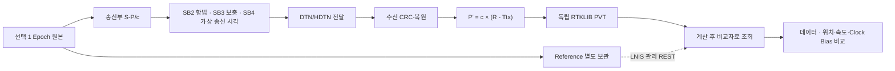

# LNIS 송수신 시험

**이 시험은 데이터를 보내고 받는 데 걸린 시간을 GNSS 의사거리로 계산했을때, PVT 계산기가 그 공통 지연을 수신기 시계 오차(Clock Bias)로 해석하는지 확인하는 시험입니다.**

원본 GNSS의 한 관측 시점(1 Epoch)으로 기준 PVT를 구한 뒤, 시험 시작부터 수신 완료까지 걸린 시간을 측정합니다.
그 시간을 모든 위성의 의사거리에 동일하게 추가하고 PVT를 다시 계산하여, 원본 대비 위치·속도·Clock Bias가 얼마나 달라졌는지 비교합니다.
GNSS 수집 후 시험 시작 전까지 기다린 시간은 추가하지 않습니다.

```text
원본 GNSS → 기준 PVT 확보 → 시험 시작·전송 → 수신 완료·지연 측정
         → 위성별 의사거리에 같은 지연 추가 → PVT 재계산 → 기준값과 비교
```

**예상 결과는 위치와 속도는 거의 유지되고, Clock Bias는 추가한 지연시간만큼 증가하는 것입니다.**
이 결과를 미리 넣어 맞추는 것이 아니라, 계산기가 실제로 구한 Clock Bias 증가량과 측정 지연의 차이를 확인합니다.
위치·속도의 작은 변화도 그대로 표시합니다. 실제 위성이 지연시간 동안 이동한 상황이나 실제 위치 정확도를 검증하는 시험은 아닙니다.

Java 21 · Spring Boot · H2 · HTML/JavaScript. 기존 AFS 코덱과 GPS L1 지구 PVT 계산기를 재사용합니다.

## 실행 구조

- **송신 PC:** LNIS Sender + 송신 DTN/HDTN 어댑터 + 로컬 공유 파일 폴더.
- **수신 PC:** LNIS Receiver + 수신 DTN/HDTN 어댑터 + 별도 로컬 공유 파일 폴더.
- 각 PC에서 LNIS는 한 JVM으로 실행합니다. DB와 파일은 서로 공유하지 않습니다.
- 개발 PC에서는 Docker Desktop의 8090/8091로 두 역할을 구분합니다. 운영은 WSL2 배포판 내부 Linux Docker Engine입니다.
- 어댑터는 별도 개발 프로그램입니다. LNIS가 DTN/HDTN 자체를 구현하지 않습니다.

## 실행·설정

애플리케이션 설정은 `src/main/resources/application.yml` 하나에서 관리합니다. 통합 `node` 실행만 지원하며, PC별 역할·주소·포트·토큰은 기존처럼 배포 폴더의 `.env`로 지정합니다. `server`/`node` Spring profile은 웹·통합 실행 설정을 묶는 내부 설정이며 별도 서버 실행 모드가 아닙니다.

독립 노드 배포 폴더에서 `.env`의 역할·포트·본인/상대 URL·관리 토큰을 설정하고 실행합니다.

```sh
docker compose up -d --build
docker compose ps
```

주요 설정: `LNIS_NODE_ROLE`, `LNIS_SERVER_PORT`, `LNIS_NODE_BASE_URL`, `LNIS_NODE_PEER_URL`, `LNIS_NODE_MANAGEMENT_TOKEN`,
`dtn_adapter`, `LNIS_DTN_SEND_TOKEN`, `LNIS_DTN_RECEIVE_TOKEN`.
관리 토큰은 양쪽 동일하게, 어댑터 토큰은 해당 연결 상대와 맞춥니다. 기존 DB·토큰을 임의 삭제하지 마세요.

- 독립 AFS Frame 검증시험은 제거했습니다. 과거 `/lnis/afstest/sender`, `/lnis/afstest/receiver` 북마크는 DTN 화면으로 이동합니다.
- DTN의 AFS Frame + Metadata·I/Q와 공용 AFS 코덱은 유지합니다. 기존 AFS 시험 DB·산출물은 자동 삭제하지 않으며, 이전 버전 이력은 운영 백업으로 보존합니다.
- DTN 화면: `/lnis/dtntest/sender`, `/lnis/dtntest/receiver`
- [운영 USB/WSL2 연결](deployment/node/WSL2-GNSS.md)
- [어댑터 개발자 공유 계약 — API-SPEC 맨 아래 15장 전체](API-SPEC.md#adapter-contract)

## 실제 GNSS 데이터와 Windows COM 수집 (2026-09-29)

- `real-gnss-source.ubx`: 실외 COM5에서 수신한 원본 24에폭입니다.
- `real-gnss-10epochs.graw`: 마지막 연속 10에폭, 31,470 bytes. GPS Week 2438 / TOW 201738.989 ~ 201747.989입니다. 각 에폭을 선행 항법정보와 함께 독립 계산하여 위치·속도 PVT 유효성을 확인했습니다. 이전 실내 데이터는 `data/gnss-backup-*`에 보관했습니다.
- 설정 → GRAW 파일 적용 후 **GNSS 기준시간**에서 사용할 1에폭을 선택합니다. 숨겨진 **실측 GNSS 10에폭 불러오기** 버튼도 같은 실외 파일을 사용합니다.
- **COM 입력 → 포트 조회**는 Windows 중계 사용 시 실제 COM4·COM5 등과 장치 설명을 표시합니다. 기본 통신속도는 **38400**, 8N1, 흐름제어 없음입니다. 다른 속도도 선택할 수 있습니다.
- **1 Epoch 수집**은 유효 위치·속도 계산에 필요한 관측 1에폭과 항법정보를 확보하면 자동 종료합니다. 최대 120초이며, 부족한 신호·항법정보는 상태에 표시합니다.
- **UBX / GRAW 파일 → 파일 적용**에서 수신기 `.ubx`를 바로 선택할 수 있습니다. RAWX·SFRBX를 기존 내부 GRAW 구조로 자동 해석하므로 별도 변환 작업이 필요하지 않습니다. 기존 `.graw`도 지원합니다. UBX는 64 MiB 이하, 관측 1000 Epoch 이하, 변환 결과는 기존 1 MiB 제한을 적용합니다. 초과하면 잘라서 전송하지 않고 짧은 파일을 요청합니다. UBX 파일 수정 시각은 보관 시각일 뿐 메시지별 실제 수신 시각이 아닙니다. NAV-PVT·NMEA 등은 시험 입력에 포함하지 않습니다.
- 시간 초과 시 관측값이 있으면 마지막 1에폭과 그 이전 항법정보를 보관하고 **이 데이터 사용 / 다시 수집 / 사용 안 함**을 선택합니다. 승인 전에는 시험에 사용할 수 없고 새로고침 후에도 선택 대기가 유지됩니다. 승인한 데이터는 PVT 없이 RAW 송수신이 가능하며, AFS는 필요한 GPS 항법정보가 있을 때만 가능합니다. I/Q는 기존처럼 유효 위치·속도가 필요합니다. 관측값이 없거나 수집 오류가 발생한 경우에는 다시 수집해야 합니다.

### 시작과 유센터 전환

현재 PC에서는 `C:\lnis-compose\start.ps1` 또는 `START.cmd`를 실행합니다. 소스는 `deployment/node/start.ps1`입니다. 송신 노드에서는 Windows Java 중계 프로그램을 숨김 실행한 뒤 WSL/Docker 웹서버를 시작합니다. **`docker compose up`만으로 Windows 중계가 시작되지는 않습니다.** 이미 중계가 실행 중이면 Docker만 다시 시작해도 됩니다.

Windows COM은 그대로 유지되므로 USB를 WSL에 넘길 필요가 없습니다. 송신 설정 또는 수신 화면에서 포트·통신속도를 선택하고 **연결**한 뒤 사용합니다. **1 Epoch 수집** 완료·중단이나 브라우저 종료는 연결을 해제하지 않습니다. 유센터에서 같은 COM을 사용하려면 먼저 웹에서 **연결 해제**하세요. 서비스 재시작 후에는 수동 연결합니다.

- **시간 맞추기 → 보정량 확인 → 적용**은 서비스 내부 시험 시각만 보정합니다. Windows·WSL·어댑터 시계와 운영 로그·DB 관리 시각은 변경하지 않으며 관리자 권한도 필요 없습니다.
- 화면은 UTC+09:00·밀리초로 갱신하며 실제 측정은 서버에서 수행합니다. 상세에는 PC UTC·시험 UTC·보정량·조회 왕복 시간을 표시합니다. USB 메시지 지연·네트워크 비대칭이 포함되므로 표시 자릿수나 GNSS tAcc는 동기화 정확도가 아닙니다.
- 시간원은 로컬 GNSS → 최근 5분 내 GNSS 보정되고 입력이 유효한 상대 서비스 → 공통 NTP 순입니다. GNSS의 서로 다른 UTC 샘플 5개 이상·최근 3초 이내·샘플 산포 50ms 이하를 요구합니다. 이는 입력 안정성 검사이지 절대 정확도 보장이 아닙니다. NTP 기본은 `time.windows.com`; 컨테이너 환경변수 `LNIS_NTP_SERVER`로 양쪽에 같은 서버를 지정하며 빈 값으로 폴백을 끕니다.
- 양쪽 서비스가 연결되고 진행 중인 시험이 없을 때만 적용합니다. 한쪽 GNSS만 있으면 그쪽부터 보정하세요. 모든 시간원이 불가하면 기존 내부 시각을 유지하며, 초기 상태는 PC 시각을 사용합니다. 적용 후 입력 단절 시 시각을 되돌리지 않고 단조 시계로 진행합니다. 5분 후 재확인을 권장하며 재시작 시 보정은 초기화됩니다.
- 전달 지연은 **보정된 수신 완료 시각 − 보정된 송신 시작 시각**이며 같은 보정량을 다시 빼지 않습니다. 보고서 `senderClock`·`receiverClock`에 원래 PC 시각과 보정 근거를 보존합니다. 수신 원문 접수 기록 `arrivedAt`은 실제 PC 시각입니다. 과거 시험에는 보정 근거가 없을 수 있습니다.
- GNSS가 없거나 한쪽에만 있어도 UBX/GRAW 파일·REST 시험은 그대로 동작합니다. GNSS 상태와 상대 서비스/어댑터 연결 상태는 별개입니다.
- 일시 분리 시 고유 식별자가 일치하는 장치 한 개만 자동 재연결합니다. 식별 불가·중복 장치는 수동 확인하며, 다른 장치로 임의 전환하지 않습니다. 송신은 최근 항법정보를 제한적으로 보관해 다음 수집에 재사용합니다.
- 수신 화면의 **상대 송신 서비스 → 연결 확인**은 입력 주소만 검사합니다. **저장·적용**은 인증·역할·준비 상태를 확인한 뒤 수신 서버 DB에 저장하며 Reference RAW/PVT 조회에도 반영됩니다. 시험 중에는 변경할 수 없습니다. 어댑터 주소는 기존처럼 브라우저에 저장합니다.

2026-09-29 상시 연결 검증: 자동 테스트 213건 통과·선택적 4건 제외, 웹 회귀 검사 통과. 실측 UBX의 RAW/AFS 송수신·PVT 비교와 수신 측만 GNSS가 연결된 RAW 시험을 확인했습니다. COM4의 UTC 수신, 120초 PVT 미확보 후 연결 유지, 사용자 승인 후 RAW 수신·복원(비교 불가), 수신 주소 저장·재시작 유지도 확인했습니다. 이 검증에서 90초 I/Q 전체 생성·추적은 재실행하지 않았습니다.

Windows 중계는 직렬 바이트 송수신과 수신 지점의 NAV-TIMEUTC 추정만 담당합니다. 관측값 해석·설정 복원·GRAW·PVT는 웹서버에서 수행합니다. 인증 토큰은 로컬 `.serial-bridge.env`와 `serial-bridge/bridge.properties`에 생성되며 저장소에 넣지 않습니다. 직렬 세션 통신이 30초 끊기면 COM을 반환합니다. 비정상 종료 시 임시 수신기 설정 복원은 보장하지 않으며 BBR/Flash 영구 설정은 변경하지 않습니다. 중계와 서버를 함께 갱신해야 GNSS 보정이 가능합니다.

전체 검증 및 운영 절차는 [Windows COM 중계](deployment/node/WINDOWS-SERIAL-BRIDGE.md)를 참고하세요. 직접 USB를 넘기는 이전 방식은 [WSL2-GNSS.md](deployment/node/WSL2-GNSS.md)에 남겨 두었습니다. 두 방식을 동시에 사용하지 마세요.

실측 파일 해시는 [GNSS-VALIDATION.json](GNSS-VALIDATION.json), 형식 설명은 [REAL-GNSS.md](REAL-GNSS.md)를 참고하세요.

## 시험

2026-09-27 재배포 검증: GNSS RAW·AFS v4 원본 복원 PVT는 `PASS`, 두 방식의 지연 반영은 `MEASURED`를 확인했습니다. 새 90초 I/Q(2,160,000,000 bytes)는 송수신 해시 일치 및 69 Epoch의 유효 위치·속도를 확인했습니다. I/Q 오차에는 합격 허용오차를 적용하지 않습니다. 개발용 REST 중계에서 검증한 결과이며 실물 COM·실제 DTN/HDTN 엔진 검증과 구분합니다.

DTN의 GNSS 수집 데이터 화면은 관측값(RAWX)과 항법정보(SFRBX)를 별도 표로 표시합니다. 항법 메시지는 중복을 포함해 보존하며, 펼침 메뉴에서 저장된 전체 필드를 확인할 수 있습니다. 현재 GRAW는 RAWX/SFRBX와 수집 메타데이터를 저장하며 NAV-PVT·NMEA 등 수신기의 다른 출력은 포함하지 않습니다.

1. 송신 화면 우측 상단 **설정**에서 시험 종류·DTN/HDTN 경로·연결 주소·COM/GRAW 입력을 선택합니다. GRAW 파일 적용과 저장된 I/Q 선택도 설정에서 합니다.
2. **시험 화면으로** 돌아와 COM 수집·I/Q 생성·전송을 실행하고 관측값·송신 지구 PVT를 확인합니다. 화면 전환은 입력과 진행 상태를 유지하며, 처리 중 설정은 읽기 전용입니다. 선택값은 매 REST JSON에 포함됩니다.
3. 수신 결과와 JSON 원문을 확인합니다.

- **HDTN 설정:** 동시 번들 수·합계 용량, 우선순위, 저장 공간 부족 시 대기 시간, 최대 번들 크기, TCPCL 세그먼트 크기, 삭제 정책을 설정하며, 고급 설정에서 저장 용량·LTP·ACS를 조정합니다. 전체 기본값 복원 버튼을 제공합니다. HDTN이 포함된 경로에서만 `hdtnConfig`로 전달하며 시험 시작 시 DB에 확정 저장합니다. 실제 적용은 어댑터가 담당합니다. DTN 전용 설정은 규격 확정 전까지 전송하지 않습니다.
- **설정 프리셋:** 송신 설정 상단에서 시험 유형·엔진 조합·HDTN 10개 값을 이름으로 저장합니다. 송신 서버 DB에 최대 5개를 공유하며, 불러오기 후 편집해 **변경 저장**하거나 **관리**에서 이름 변경·삭제합니다. 연결 주소·COM·입력 파일은 바꾸지 않고 시험도 자동 시작하지 않습니다. `/clear` 및 시험 보관기간 정리로 프리셋은 삭제되지 않습니다.
- **시험 요청 설정:** 송신·수신 요약의 값은 해당 시험에 기록된 `hdtnConfig`입니다. 편집 중 설정이나 어댑터의 실제 적용 확인값이 아닙니다. **전체 설정**에서 정확한 값·단위를 확인합니다.
- **로그 확대:** 송신·수신 로그 우측 확대 아이콘으로 동일 로그 영역을 전체화면으로 봅니다. 시험 선택·상세 보기·스크롤·갱신은 유지되며 `Esc` 또는 축소 아이콘으로 돌아옵니다. 지원하지 않는 환경에서는 브라우저 내부 최대화로 전환합니다.
- **설명 구성도 `/dtn-intro`:** 송신부 PC와 수신부 PC 안의 LNIS·어댑터·라우터를 구분합니다. 통신 버튼을 누르면 REST JSON 요청을 확인하고, I/Q에서는 각 PC의 별도 공유 폴더를 통한 BIN 쓰기·읽기 경로를 확인합니다.
- **여러 시험 송신:** 어댑터 요청이 끝나면 이전 시험의 최종 수신을 기다리지 않고 다음 시험을 시작합니다. 클릭마다 새 testId와 입력·설정 스냅샷을 만들며, 수신 서비스에 먼저 등록합니다. 어댑터 응답 미확인은 자동 재전송하지 않고 수신 대기로 남깁니다.
- **순서와 시간에 독립적인 수신:** RAW·AFS·I/Q 모두 testId·인증·원문 해시로 검증합니다. 외부 수신 및 계산 순서 대기는 시간 제한이 없습니다. 정상 본문을 먼저 저장하고 계산은 한 건씩 진행합니다. 지연 측정에는 계산 대기시간을 포함하지 않습니다. 준비·계산 작업 자체의 제한은 단계 시작부터 일반 10분, I/Q 20분입니다.
- **시험별 종료:** 시험 기록에서 대상을 선택한 뒤 `대기 종료` 또는 `계산 중지`를 누릅니다. 다른 시험에는 영향을 주지 않습니다. 송신에서 종료하면 상대 수신 서비스에도 요청하고, 연결이 끊기면 `종료 전달 중`으로 남겨 재시도합니다. 종료 후 늦게 도착한 정상 데이터는 원문만 보관하며 결과를 다시 계산하지 않습니다. 이미 어댑터에 전달된 번들의 회수는 보장하지 않습니다. I/Q 생성은 별도의 `생성 취소`를 사용합니다.
- **보관·복구:** 대기 중 시험과 참조 파일은 자동 삭제에서 보호합니다. 재기동 후 수신·계산 대기는 이어가되, 끊긴 준비·계산은 실패 처리합니다. 어댑터 요청 중 재기동은 접수 미확인으로 표시하고 자동 재송신하지 않습니다. 과거 실패 기록은 자동으로 재개하지 않습니다.
- **라우팅 시험 범위:** 여러 건의 지연 전달·순서 역전·내용 보존을 확인할 수 있습니다. 실제 중계 경로는 라우터 로그로 별도 확인해야 하며, LNIS 대기 제한 제거와 별개로 번들 수명(TTL)은 어댑터에서 설정해야 합니다.
- 수신 화면은 새 JSON이 접수되면 해당 시험을 자동 선택합니다.

| 시험 | 전송 내용 | 검증 |
|---|---|---|
| GNSS RAW | 1 Epoch 가상 송신 시각 변환 JSON | 데이터 대조·지연 PVT |
| AFS Frame | v5 SB2·SB3 항법 + SB4 가상 송신 시각 | 프레임 복원·데이터 대조·지연 PVT |
| I/Q Sample | 90초 BIN 경로·크기·해시 + 생성 정보·초기 기준 PVT | 파일 무결성·I/Q 추적 관측값·프레임 항법 기반 지구 PVT 오차(v2) |

PVT는 지구 ECEF GPS L1 SPP입니다. 송수신 일치는 계산 재현성 검증이며 실제 위치 정확도 보증이 아닙니다.
수신 화면은 독립 계산 결과와 별도 조회한 송신 기준을 비교합니다. I/Q의 기준값은 기존 전송 JSON을 사용합니다. 송신 화면에는 기준 PVT와 상대 상태를 표시합니다.

송수신 로그의 **상세 로그**에서 처리 단계·수량·검증 결과를 확인하고 시험 기록을 선택해 TXT로 다운로드할 수 있습니다. LNIS 자체 처리 로그는 각 PC에 저장합니다. 어댑터가 수신 JSON에 `dtnLogsBase64`로 첨부한 로그는 수신에서 해석하여 수신 상세 로그에만 남깁니다. 송신에는 상대 수신·완료·실패 상태만 표시합니다. 잘못된 로그 형식은 경고로 남기며 시험 데이터 접수를 막지 않습니다. ‘화면 지우기’는 저장 기록을 삭제하지 않으며, 시험에 연결하지 않은 준비 로그는 7일 후 정리합니다.
신규 RAW/AFS 시험에는 유효한 Reference PVT를 계산할 수 있는 1 Epoch 입력이 필요합니다.

### 1 Epoch 지연 반영 PVT와 Clock Bias 확인

GNSS RAW와 AFS는 항상 지연 PVT 시험을 수행합니다. 체크박스는 없으며 GNSS 기준시간에서 선택한 1 Epoch와 선행 항법정보를 사용합니다. 파일을 처음 적용할 때는 첫 유효 Epoch를 기본 선택하고, 이후 사용자의 선택을 유지합니다. I/Q는 기존 RF 추적·복호 경로입니다.

```text
S = 송신 서버 시험 시작 요청 접수 시각
R = 수신 서비스 본문 수신 완료 시각
Δt = R − S
송신: Ttxᵢ = S − Pᵢ/c
수신: P′ᵢ = c × (R − Ttxᵢ), GNSS 계산 시각 = t₀ + Δt
비교: Clock Bias 변화 = 수신 Bias − Reference Bias
      시간 잔차 = Clock Bias 변화 − Δt
```

c=299,792,458 m/s입니다. 수집 후 시작 전 대기는 제외하고 시작 이후 준비·어댑터·전송 대기는 포함합니다. 보정 송신 시각은 가상 시각입니다. 원본 GNSS 시간축·궤도를 유지하므로 실제 미래 위성 운동의 재현이 아닙니다.

송신은 시험별 선택 원본과 Reference를 고정 보관합니다. 수신은 전달된 값만으로 PVT를 계산한 **후** LNIS 관리 REST로 원본과 Reference를 조회합니다. 받은 원본으로 전송 데이터를 재생성해 해시를 대조합니다. 의도한 변환·제외를 데이터 손실로 오인하지 않으며 원본으로 수신 계산을 대체하지 않습니다.

조회가 일시 실패하면 계산 결과를 보존하고 10·30·60초, 이후 60초 간격으로 재시도합니다. 삭제·인증 오류·자료 불일치는 별도 상태와 재조회 버튼으로 표시합니다.

| 위치 | 표시 내용 |
|---|---|
| 송신 | 원본 Reference, 송신 작업, 어댑터 접수 및 상대 상태 |
| 수신 원본 GNSS 관측값 | 실제 전달·복원한 관측값과 가상 송신 시각 |
| 의사거리 두 열 | 별도 조회한 원본 / 수신 계산한 변환 후 값(빨간색) |
| GNSS 기준시간 옆 | 데이터 일치·불일치·비교 대기·비교 불가 |
| 수신 PVT | 위치·속도·Clock Bias 차이와 시간 잔차 |
| 송신 원본·비교 기준 펼치기 | 별도 조회한 시험 원본 RAW |

원본 조회 전 의사거리는 `—`입니다. AFS에서 미전송한 반송파·편차 코드 등을 원본으로 채워 실제 받은 값처럼 표시하지 않습니다. 상세 로그·원문 다운로드는 실제 처리한 값만 제공합니다.

공통 지연은 주로 Clock Bias 증가로 나타납니다. Doppler를 유지해도 계산 위치·위성 방향·수치 정밀도에 따라 속도에 작은 차이가 생길 수 있습니다.
`MEASURED/PARTIAL/INCONCLUSIVE`는 측정 완료/부분 비교/비교 불가이며 데이터 일치 여부와 별개입니다. 합격 허용오차는 없습니다. 두 PC 시계 동기화는 시험 전제이며 표시 자릿수는 측정 정확도가 아닙니다.

## AFS 프레임 안에서 PVT 입력 전달

신규 AFS는 `schemaVersion=5`, `format=LNIS-AFS-GNSS-v5`입니다. 1 Epoch GPS L1 관측 위성마다 한 프레임을 만듭니다.
JSON에는 시험 식별·엔진 설정·프레임 목록만 남고 원본 metadata·Reference는 넣지 않습니다.


```mermaid
flowchart LR
    RAW[선택 1 Epoch 원본] --> REF[Reference 별도 보관]
    RAW --> TX[송신부 S-P/c]
    TX --> FRAME[SB2 항법 · SB3 보충 · SB4 가상 송신 시각]
    FRAME --> ADAPTER[DTN/HDTN 전달]
    ADAPTER --> DECODE[수신 CRC·복원]
    DECODE --> RANGE["P′ = c × (R - Ttx)"]
    RANGE --> PVT[독립 RTKLIB PVT]
    PVT --> FETCH[계산 후 비교자료 조회]
    REF -. LNIS 관리 REST .-> FETCH
    FETCH --> COMPARE[데이터 · 위치·속도·Clock Bias 비교]
```

### 6,000비트 구조와 부호화

| 구간 | 부호화 전 | 오류 검출·정정 | 전송 비트 |
|---|---:|---|---:|
| 동기 패턴 | 68 | 고정 패턴 | 68 |
| SB1 | FID·TOI 입력 | 기존 BCH | 52 |
| SB2 | 데이터 1,176 + CRC 24 = 1,200 | 기존 LDPC·천공 | 2,400 |
| SB3 | 데이터 846 + CRC 24 = 870 | 기존 LDPC·천공 | 1,740 |
| SB4 | 데이터 846 + CRC 24 = 870 | 기존 LDPC·천공 | 1,740 |
| 합계 | | | **6,000 = 750 bytes** |

```text
부호화 전: SB2 [1176 + CRC24]  SB3 [846 + CRC24]  SB4 [846 + CRC24]
                  ↓ LDPC             ↓ LDPC            ↓ LDPC
부호화 후:       2400                1740               1740
                  └──────────────────┬──────────────────┘
                           5880비트 인터리빙 (98×60)
최종:      [동기 68][SB1 BCH 52][인터리빙된 SB2·SB3·SB4 5880] = 6000
```

최종 비트열에서 SB2·SB3·SB4가 그대로 연속 배치되는 것은 아닙니다. 각 크기·CRC·BCH·LDPC·인터리빙은 기존 SIM/PocketSDR를 사용합니다. 공식 근거는 [NASA LSIS AFS Volume A v1.0](https://www.nasa.gov/wp-content/uploads/2025/02/lunanet-signal-in-space-recommended-standard-augmented-forward-signal-vol-a.pdf)입니다. SB3·SB4는 **LNIS 시험용 확장**이며, type=63은 공식 할당을 주장하지 않는 로컬 식별값입니다. 지구 GPS 정보를 사용하는 이 시험은 LunaNet 운용 메시지 전체의 적합성 인증이 아닙니다.

### LNIS SB3·SB4 배치 (CRC 제외)

다중 비트는 상위 비트부터 저장합니다. TOW는 binary64, Doppler는 binary32입니다.
가상 시각은 Unix 정수 초 64비트와 초 미만 femtosecond 50비트로 나눠 절대시각 부동소수점 뺄셈의 정밀도 손실을 피합니다.

```text
공통 헤더 57비트:
  messageType 6 (=63) | version 8 (=3) | block 3 | epochIndex 32 (=0) | PRN 8

SB3 846비트:
  헤더 57 | 항법 존재 1 | SB2에 없는 LNAV 비트 459 | 미사용 329
  사용 517비트. LNAV 720비트 중 SB2의 261비트를 제외한 보충정보.

SB4 846비트:
  헤더 57 | 관측 순서 8 | GPS week 16 | 원본 TOW 64
  가상 송신 Unix 초 64 | 초 미만 fs 50
  Doppler 32 | C/N₀ 8 | 추적 상태 8
  전리층 존재 1 | 항법 PRN 8 | 전리층 항법 페이지 240
  시험 시작 Unix 초 64 | 초 미만 fs 50 | 미사용 176
  사용 670비트. 원본 의사거리는 저장하지 않음.
```

SB3·SB4의 **미사용 데이터 영역은 각각 첫 비트부터 `010101…`로 채웁니다.**
존재하지 않는 항법·전리층 필드의 0 표식, CRC·LDPC·천공 규칙은 별개이며 기존 규칙을 유지합니다.
시작 시각은 프레임과 인증된 사전 등록 값이 일치해야 합니다.
fs 저장은 수치 표현 정밀도이며 PC 시계의 fs 정확도를 뜻하지 않습니다.

AFS에는 GPS 계산에 필요한 관측·항법정보만 넣습니다. 반송파·편차 코드·비GPS 신호 등 미전송 항목은 수신 표에서 `—`로 구분합니다.
전체 원본은 계산 후 LNIS끼리 별도로 조회합니다. RAW 시험은 같은 시각 변환을 적용한 JSON 레코드를 보내며 나머지 원본 필드는 유지합니다.

I/Q는 RF 추적 시험이므로 기존 version=2 프레임 관측 형식을 유지합니다.
그 SB4의 실제 사용량은 **506비트**입니다(과거 문서의 606비트는 오기).
새 AFS 지연 시험과 같은 물리 부호화기를 사용하지만 I/Q 원본 의사거리를 지연 시험 가상 시각으로 바꾸지 않습니다.


## I/Q Sample

I/Q는 `LNIS-IQ-FILE-v2`, `pvtMethod=AFS_IQ_FRAME_PVT-v2`로 구분합니다. JSON의 PRN·첫 샘플 시각·Reference는 탐색/비교용이며 항법정보는 CRC 검증된 프레임에서 확보합니다. 4개 미만 PRN의 계산 프레임만 복원되면 메타데이터로 우회하지 않고 오류를 표시합니다. I/Q에는 기존처럼 통신 지연 재계산을 적용하지 않습니다.


## 빌드·검증

```powershell
.\gradlew.bat nativeBuild
.\gradlew.bat check bootJar -PnativeCandidate=build/native-pvt
.\gradlew.bat syntheticGraw
```

- JAR: `build/libs/lnis.jar`
- 합성 입력·예상 PVT: `build/dtn-example/synthetic-earth-pvt.graw`, 동일 이름 JSON
- Linux 코덱: `build/native-linux/libLnisAfsCodec.so`
- Windows 후보 DLL: `build/native-pvt/LnisAfsCodec.dll` — 기존 DLL을 자동 덮어쓰지 않습니다.
- 90초 I/Q 생성기·수신 추적기: `build/iq/afs_sim`, `build/iq/pocket_trk`
- 배포 ZIP: `gradlew.bat linuxNodeDistZip -PnativeCandidate=build/native-pvt`

### 원본·수정본 위치

- `native/vendor/`: 필요한 원본 **파일 전체**를 주석·줄바꿈까지 그대로 보관합니다. 외부 프로젝트 전체를 복사한 것은 아닙니다.
- `native/patches/`: 불가피한 수정만 보관합니다. 수정 위치의 `LNIS 변경` 주석에 목적과 내용을 적었습니다.
- `native/lnis_*.c`, `native/iq_earth.c`: 서비스 입력·지구 PVT·AFS 연결 코드입니다.

### 새 PC 배포

`build/distributions/lnis-node-linux.zip`을 송신·수신 PC에 각각 풀고 `.env.example`을 `.env`로 복사해 역할과 주소를 설정합니다.


```sh
docker build -t lnis-native-verification:local build/native-system/bundle
docker compose -f src/test/dtn-native-compose.yml up -d
# 양쪽 서비스 시작 완료 후 실행 (앞서 syntheticGraw 실행 필요)
node src/test/js/dtn-live-roundtrip.mjs
docker compose -f src/test/dtn-native-compose.yml down
```

결과는 `build/native-system/results.json`에 기록합니다. 개발용 REST 중계 검증이며 실제 DTN/HDTN 동작 검증은 아닙니다.

일반 `build`는 운영 폴더를 변경하지 않습니다. 배포는 명시적으로 수행합니다.
실제 F9T·운영 WSL2 USB·실제 DTN/HDTN 연동은 합성 데이터 회귀시험과 별도로 확인해야 합니다.
중앙 서버 + 별도 Windows Agent 실행·탐색·제어 WebSocket과 전용 배포 파일은 제거했습니다. 배포 기준은 `deployment/node`와 `linuxNodeDistZip`입니다. 소스 저장소 루트가 아니라 배포 ZIP을 푼 각 노드 폴더에서 `docker compose up -d --build`를 실행합니다. Windows 개발용 네이티브 검증은 유지합니다.


## 유지보수할 때 찾을 위치

수신 PVT의 지연 반영 시험은 **시험 전달 지연 → 시계오차 변화 → 지연 반영 잔차**를 비교합니다. 잔차는 `(수신 Clock Bias − 송신 기준 Clock Bias) − 전달 지연`이며 통신 지연 측정오차나 위치 정확도를 뜻하지 않습니다. 위치·속도 차이는 원본 대비 변화량입니다. `계산 근거·상세`에서 접수 시각(UTC)·원래 정밀도의 수치·축별 변화를 확인할 수 있습니다. 전달 지연은 준비·변환·전송 대기와 PC 시계 차이를 포함할 수 있고 수신 후 PVT 계산은 제외합니다. 동기화 정확도와 허용오차는 확인되지 않았으므로 지연 시험은 합격 판정 없이 측정값만 표시합니다.

| 영역 | 위치 | 역할 |
|---|---|---|
| 설정·노드 | `server/config`, `server/node` | 시작·종료, 역할·상태, 상대 PC 연결 |
| GNSS 입력 | `server/gnss` | COM·UBX·GRAW 수집과 저장 |
| AFS·PVT·I/Q | `server/afs`, `server/pvt`, `server/iq` | 변환·계산·생성·트래킹 |
| 시험 | `server/dtn` | 등록·REST 송수신·진행·결과 저장 |
| 관리·실시간 | `server/management`, `server/realtime` | 보관·삭제·브라우저 이벤트 |
| 공통 | `server/common` | 기존 공통 모델·HTTP·해시·로그 |
| 화면 공통 | `static/assets/common` | 기본 CSS, HTTP 요청, 노드 연결 |
| DTN 화면 | `static/assets/dtn` | 송수신 화면, 어댑터 상태, 관측값·원문·로그 |

## Docker 로그 확인

송신·수신 콘솔은 `Asia/Seoul`(한국 시간, `+09:00`)로 표시합니다. 로그 앞 시각은 **서버가 기록한 시각**이며,
외부 어댑터·브라우저에서 발생한 메시지의 `occurredAt`은 **원래 발생 시각**입니다. 표시 시간대 통일은 PC 시계 동기화나 GNSS 계산 보정이 아닙니다.

| 등급 | 내용 |
|---|---|
| INFO | DTN·AFS 시험 진행/상세 이벤트, 실제 어댑터 송신·수신 JSON, 변경 API 결과, 연결 상태 변화 |
| WARN | 매번 발생하는 연결 실패·타임아웃·4xx 요청 거절 및 기존 경고 |
| ERROR | 5xx·내부 처리 오류 및 기존 오류 이벤트 |
| DEBUG | 정상 조회·폴링·보고서·원문 다운로드, HTTP 시작과 헤더, 상세 통신 스택 |

`detail=true`인 시험 로그도 INFO에서 확인할 수 있습니다. 화면 상세 토글을 해제해도 콘솔 출력은 유지됩니다.
저장된 시험/원문/보고서를 화면에서 조회하는 동작은 INFO에 본문을 재출력하지 않습니다.
시험 서버 이벤트는 발행 시 한 번, 브라우저에서만 생기는 메시지는 공통 화면 로그 API로 한 번 기록합니다.
브라우저가 서버에 연결되지 못한 동안의 화면 전용 메시지는 화면에 남고 재전송하지 않습니다.

`API_END`의 `direction=OUT`은 LNIS가 보낸 요청, `IN`은 LNIS가 받은 요청입니다.
`method`, `url`, `status`, `elapsedMs`, `requestBytes`, `responseBytes`로 어떤 요청과 응답인지 확인합니다.
IN의 `peer`는 Servlet이 식별한 클라이언트 IP·포트, `local`은 서버 측 IP·포트이며 Docker/NAT/프록시 환경에서는 내부 주소일 수 있습니다.
`mapping=/lnis/api/v1/dtn/tests/{id}/report`처럼 매핑 경로도 표시하지만 컨트롤러/메서드명은 표시하지 않습니다.
요청이 매핑되기 전에 거절되면 `mapping=unresolved`입니다. OUT의 상대 서버 주소·포트는 `url`로 확인합니다.
클라이언트 포트는 임시 포트일 수 있으며, 외부 어댑터의 서비스 포트와는 다릅니다.

실제 `POST /transfers` 송신과 `POST /lnis/api/v1/dtn/receive` 수신은 `API_BODY`에 JSON을 들여써 기록합니다.
요약과 JSON 블록의 `requestId`로 연결하고, `traceId` 또는 `testId`로 관련 요청을 추적합니다.
블록은 시작/종료 표시와 빈 줄 하나로 구분하며, 비어 있는 REQUEST/RESPONSE 영역은 생략합니다.
인증정보는 가리며 방향별 16 MiB 초과·비JSON 본문은 크기와 생략 사유를 기록합니다. 정확한 원문은 기존 다운로드 기능을 사용합니다.

```bash
# 최근 100줄부터 이어서 보기: -f만 쓰면 이전 로그도 모두 표시됩니다.
docker logs --tail 100 -f lnis-node-node-1
docker logs --tail 100 -f lnis-receiver-node-1

# 지금부터 발생하는 로그만 보기
docker logs --tail 0 -f lnis-node-node-1

# 최근 10분부터 보기
docker logs --since 10m -f lnis-receiver-node-1
```

헤더·조회 본문까지 필요한 경우 Compose 폴더의 `.env`에 `LNIS_HTTP_LOG_LEVEL=DEBUG`를 설정하고
`docker compose up -d --no-deps node`로 컨테이너를 재생성합니다. 진단 후 `INFO`로 복원합니다.
Docker 로그는 서비스별 `100m` 파일 5개로 순환 보관합니다. 한도를 넘는 오래된 Docker 로그는 삭제되며,
시험 DB·원문 파일 보관 정책에는 영향을 주지 않습니다. 컨테이너 재생성 전 필요한 기존 로그는 별도로 보관합니다.

네이티브 I/Q 파일 수신기는 분석보다 파일 읽기가 앞서면 대기하고, 파일 끝에서도 남은 채널 분석을 완료한 뒤 종료합니다. 기존 20배속 설정은 유지하며, 처리 정지·읽기 오류·취소를 정상 완료와 구분합니다. 자세한 정책과 검증 방법은 `native/README.md`의 파일 재생 설명을 참고하세요.
### Outdoor capture update (2026-09-29)
COM5 outdoor capture replaced the earlier indoor fixture. real-gnss-source.ubx contains 24 RAWX epochs. real-gnss-10epochs.graw contains the final 10 consecutive epochs (GPS week 2438, TOW 201738.989 through 201747.989). All 10 passed independent position and velocity calculation with the project's native PVT engine. Earlier statements that the bundled fixture cannot compute PVT describe the superseded indoor capture. The web development replay uses this updated file.
